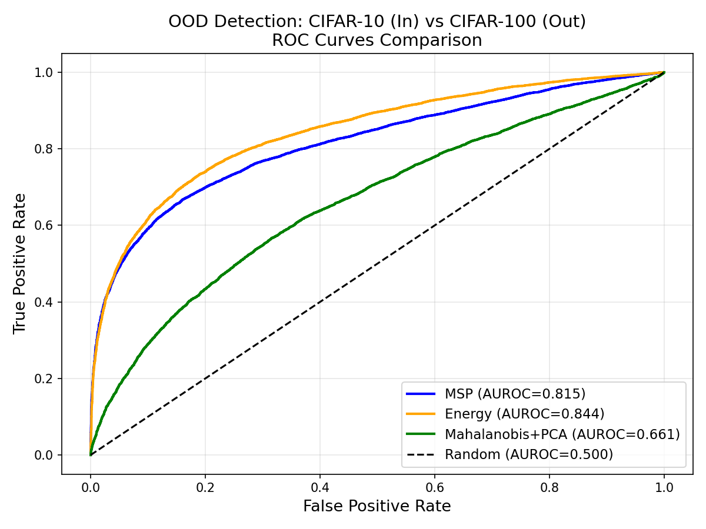

# Out-of-Distribution Detection on CIFAR-10 vs CIFAR-100

Comparing three OOD detection methods on a ResNet-18 classifier trained on CIFAR-10,
evaluated against CIFAR-100 as out-of-distribution data.

Inspired by probabilistic OOD detection research, particularly:
- Inoue et al., "Rectified Lagrangian for OOD Detection in Modern Hopfield Networks" (AAAI 2025)
- Liu et al., "Energy-based Out-of-distribution Detection" (NeurIPS 2020)

## Methods Compared
- **MSP** — Maximum Softmax Probability (baseline)
- **Energy Score** — log-sum-exp of logits (Liu et al. 2020)
- **Mahalanobis + PCA** — class-conditional Gaussian density estimation in PCA-reduced feature space

## Results

| Method | AUROC |
|---|---|
| MSP (Baseline) | 0.8146 |
| Energy Score | 0.8437 |
| Mahalanobis + PCA | 0.6606 |

## Key Observations
- Energy Score outperforms MSP by using full logit information rather than just the maximum
- Mahalanobis underperforms due to feature collapse from overfitting — 
  a known limitation when training accuracy reaches ~100% 
  (covariance matrix becomes ill-conditioned even after PCA reduction)
- This motivates more sophisticated approaches like the Rectified Lagrangian 
  (Inoue et al. AAAI 2025) which handles OOD at the feature level directly

## Setup
Run on Google Colab with T4 GPU (~20 mins training time)

## Tech Stack
Python · PyTorch · torchvision · scikit-learn · matplotlib
